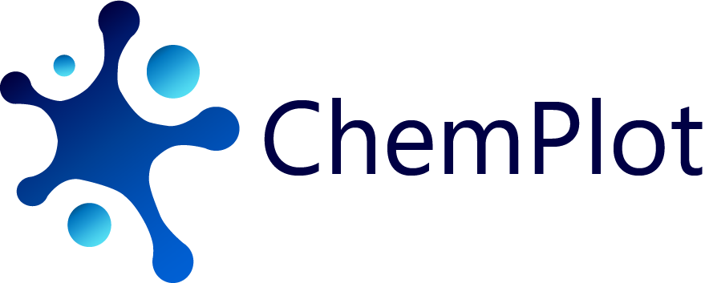

.. ChemPlot documentation master file, created by
   sphinx-quickstart on Mon Feb  1 12:13:17 2021.
   You can adapt this file completely to your liking, but it should at least
   contain the root `toctree` directive.

.. raw:: html   

    <h3> 
    
.. raw:: html

    </h3>

ChemPlot: A python library for chemical space visualization
===========================================================

In the last decades, Machine Learning (ML) applications have had a great impact on molecular
and material science. However, every ML model requires a definition of its applicability domain. 
We developed a python package, Chemplot, that allows users to plot the chemical space of their
datasets. Chemplot contains smart algorithms behind which uses both structural and tailored
similarity. Moreover, it is easy to use even for non-experts.

This guide provides the user with the explanantion of ChemPlot concepts and functionality.

.. toctree::
   :maxdepth: 2
   :caption: User Manual:
   
   user_manual/installation
   user_manual/getting_started
   user_manual/similarity
   user_manual/dimreduction
   user_manual/visualize_plots
   user_manual/add_features
   user_manual/development
   
.. toctree::
   :caption: API Reference:

   api

