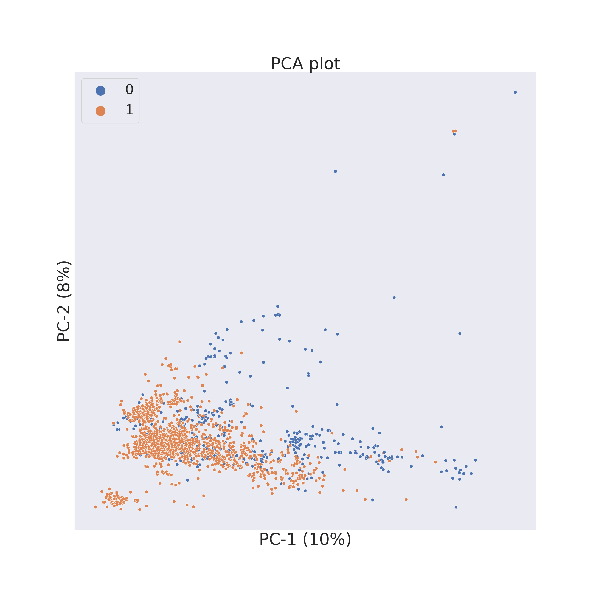
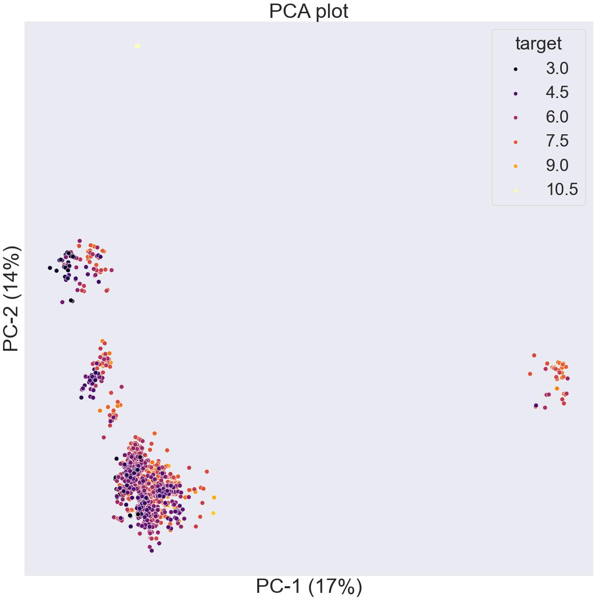
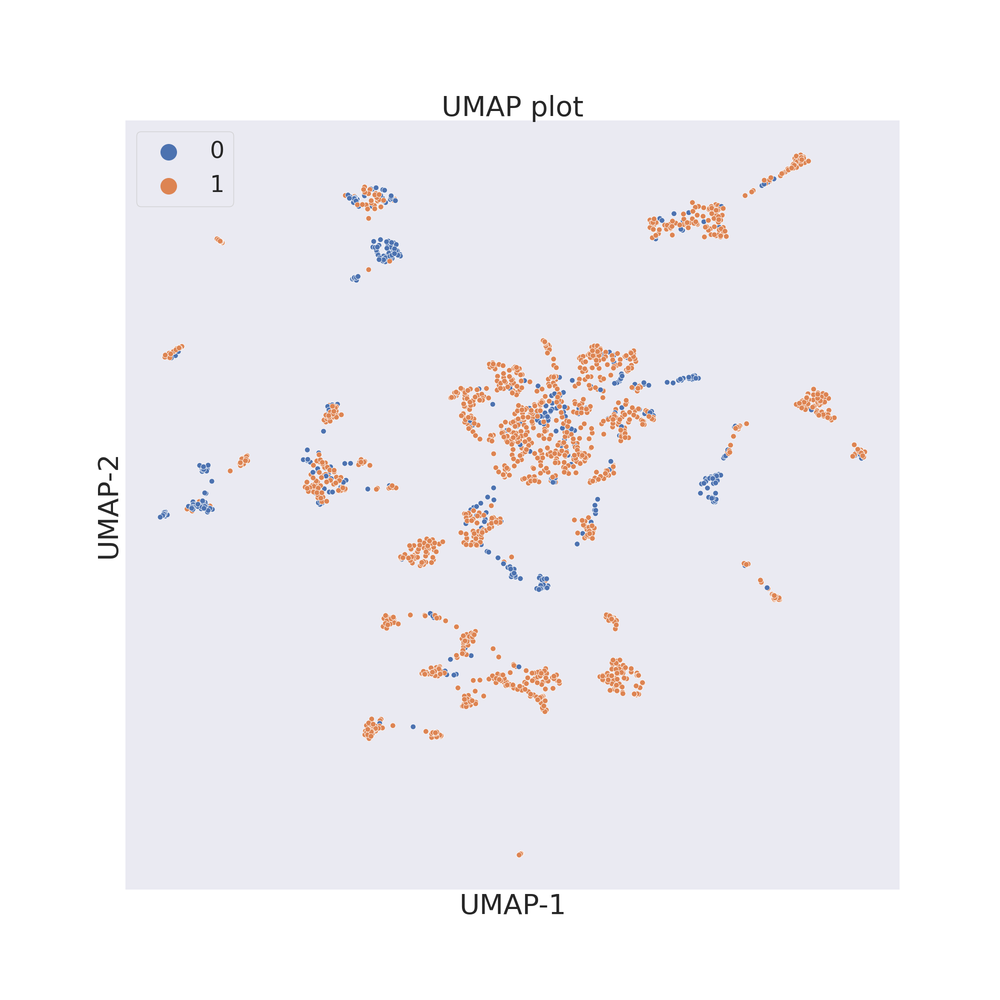
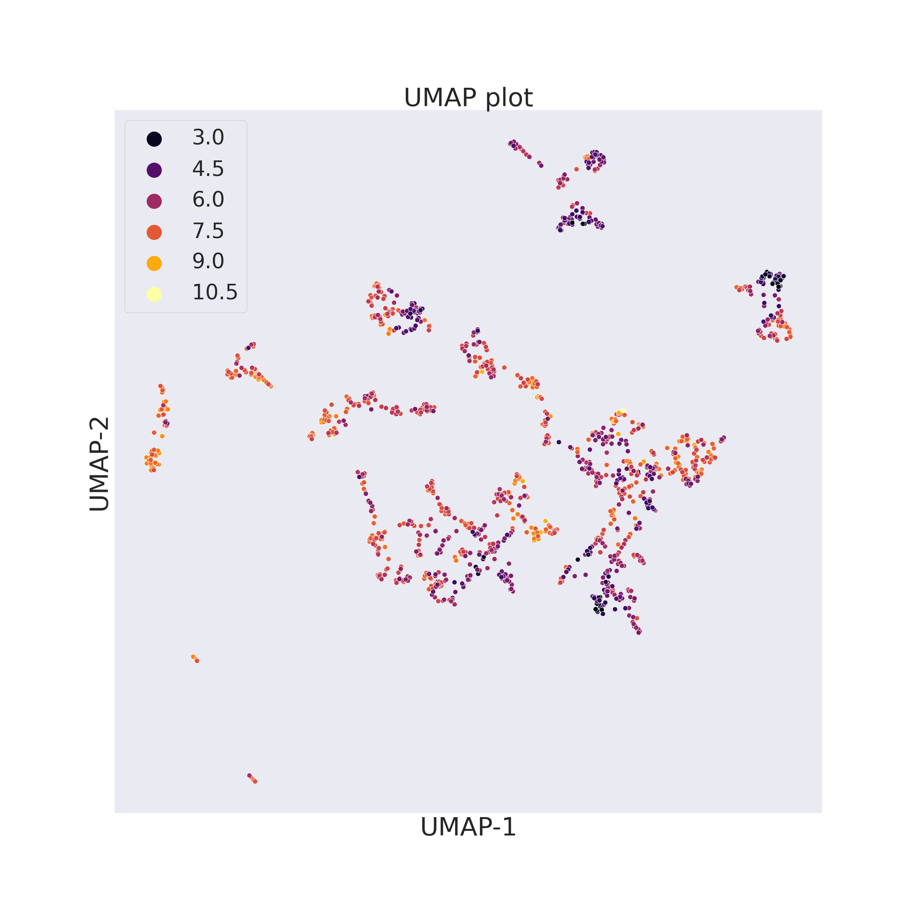

Dimensionality Reduction
========================

ChemPlot uses different machine learning techniques to reduce the number of 
dimensions, or features, of each molecule to only two in order to then create 
2D graphs. These algorithms are: PCA [1]_, t-SNE [2]_ and UMAP [3]_.

For the following examples we will use two molecular datasets, already
mentioned in the previous section: the BBBP (blood-brain barrier penetration) 
dataset [4]_ and the BACE (β-secretase inhibitors) dataset [5]_. 

.. code:: python3

    import pandas as pd
    import chemplot as cp
    
    data_BBBP = pd.read_csv("BBBP.csv")
    data_BACE = pd.read_csv("BACE.csv")
    cp_BBBP = cp.Plotter.from_smiles(data_BBBP["smiles"], target=data_BBBP["target"], target_type="C")
    cp_BACE = cp.Plotter.from_smiles(data_BACE["smiles"], target=data_BACE["target"], target_type="R")

PCA
---

ChemPlot uses PCA from the `scikit-learn <http://scikit-learn.org/stable/index.html>`__ 
package to compute the two principal components of the molecular dataset. PCA 
allows for time efficient results and for a visualization which gives a global 
view of the data. 

.. code:: python3
    
    cp_BBBP.pca()
    cp_BBBP.visualize_plot()
    plt.show()

   
.. code:: python3
    
    cp_BACE.pca()
    cp_BACE.visualize_plot()
    plt.show()

   
t-SNE
-----

ChemPlot uses t-SNE from the `scikit-learn <http://scikit-learn.org/stable/index.html>`__ 
package to reduce to only 2 the number of features of the molecular dataset. 
t-SNE looks at local neighbourhoods of molecules when it is reducing their 
dimensions. In this way the local structure of the dataset is better preserved, 
while the global structure is mostly lost when plotting the results in a 2D 
graph. However because of the locality preservation that t-SNE offers it is 
possible to visualize well-defined clusters of similar molecules that exhibit 
similar properties.  

.. code:: python3
    
    cp_BBBP.tsne()
    cp_BBBP.visualize_plot()
    plt.show()

.. image:: images/gs_tsne.png
   :width: 600
   
.. code:: python3
    
    cp_BACE.tsne()
    cp_BACE.visualize_plot()
    plt.show()

.. image:: images/bace_tsne.png
   :width: 600
   
Two important parameters of the ``tsne()`` method are ``perplexity`` and 
``pca``. The former is a positive integer parameter which defines the size of 
the neighbourhoods the algorithm will look for when analyzing the dataset. The 
higher the value of ``perplexity`` the wider the analyzed neighbourhoods. The 
recommended values for ``perplexity`` range from 5 to 50. The ``pca`` parameter 
is a Boolean value which indicates if the data has to be preprocessed with PCA. 
Its value is taken into account when plotting according to structural 
similarities when each molecule is encoded with a long number of features. 
Since t-SNE is computationally expensive, preprocessing the data can save 
substantial amounts of time when generating plots, at the cost of losing some 
of the molecular structural information. 
   
UMAP
----

ChemPlot uses UMAP from the `umap-learn <https://github.com/lmcinnes/umap>`__ 
package to reduce to only 2 the number of features of the molecular dataset. As 
t-SNE, UMAP looks at local neighbourhoods of molecules when it is reducing 
their dimensions. While this also results in 2D clusters of locally similar 
molecules, compared to t-SNE, UMAP retains more of the global structure of the 
dataset. Compared to t-SNE, furthermore, UMAP is much more computationally 
efficient and faster. 

.. code:: python3
    
    cp_BBBP.umap()
    cp_BBBP.visualize_plot()
    plt.show()

   
.. code:: python3
    
    cp_BACE.umap()
    cp_BACE.visualize_plot()
    plt.show()

   
Two important parameters of the ``umap()`` method are ``n_neighbors``, 
``min_dist`` and ``pca``. The former is a positive integer parameter which constrains the 
size of the local neighbourhood the algorithm will look for when analyzing the 
dataset. Low values of ``n_neighbors`` will make ChemPlot visualize very local 
structures. The ``min_dist`` parameter is a value which ranges from 0.0 to 
0.99. It provides the minimum distance apart that points are allowed to be in 
the 2D graph. The ``pca`` parameter is a Boolean value which indicates if the 
data has to be preprocessed with PCA. 

   
--------------

.. raw:: html

   <h3>

References:

.. raw:: html

   </h3>

.. [1] **Wold, S., Esbensen, K., Geladi, P.** (1987). `Principal component analysis. <https://www.sciencedirect.com/science/article/abs/pii/0169743987800849>`__ Chemometrics and intelligent laboratory systems. 2(1-3). 37-52.
.. [2] **van der Maaten, Laurens, Hinton, Geoffrey.** (2008). `Viualizingdata using t-SNE. <https://www.jmlr.org/papers/volume9/vandermaaten08a/vandermaaten08a.pdf?fbclid=IwAR0Bgg1eA5TFmqOZeCQXsIoL6PKrVXUFaskUKtg6yBhVXAFFvZA6yQiYx-M>`__ Journal of Machine Learning Research. 9. 2579-2605.
.. [3] **McInnes, L., Healy, J., Melville, J.** (2018). `Umap: Uniform manifold approximation and projection for dimension reduction. <https://arxiv.org/abs/1802.03426>`__ arXivpreprint arXiv:1802.03426.
.. [4] **Martins, Ines Filipa, et al.** (2012). `A Bayesian approach to in silico blood-brain barrier penetration modeling. <https://pubmed.ncbi.nlm.nih.gov/22612593/>`__ Journal of chemical information and modeling 52.6, 1686-1697
.. [5] **Subramanian, Govindan, et al.** (2016). `Computational modeling of β-secretase 1 (BACE-1) inhibitors using ligand based approaches. <https://pubs.acs.org/doi/10.1021/acs.jcim.6b00290>`__ Journal of chemical information and modeling 56.10, 1936-1949.
