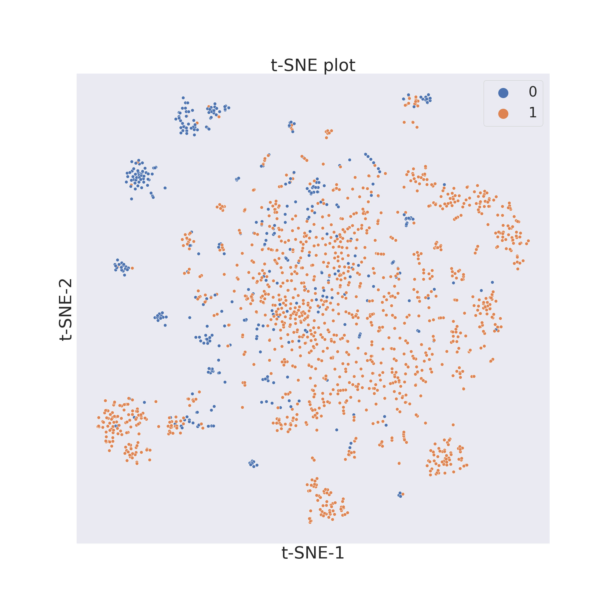
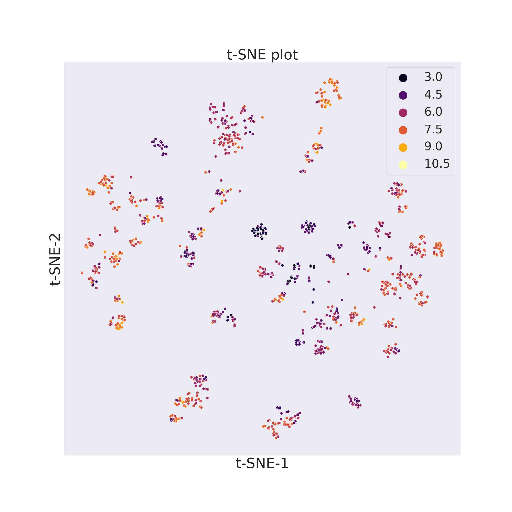
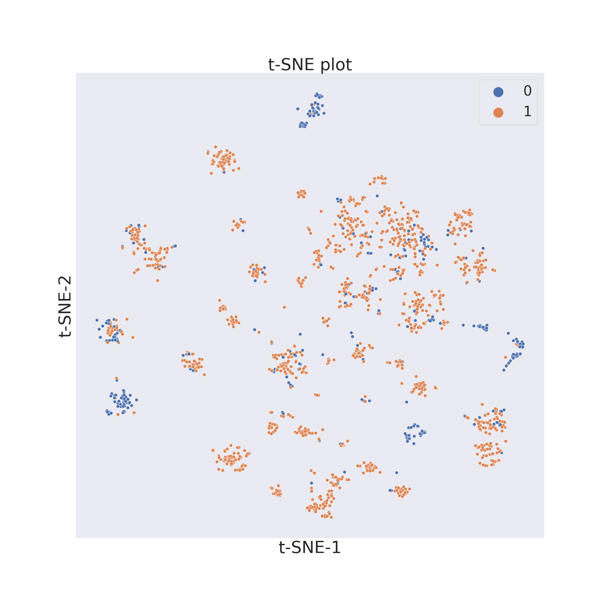
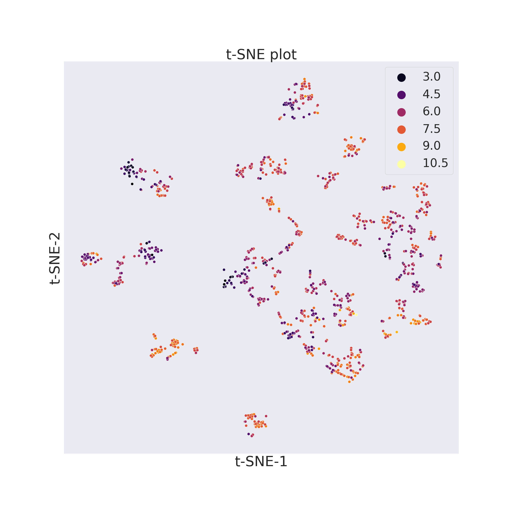

Similarity Analysis 
===================

In this example we will use two molecular datasets: the `BBBP <https://github.com/mcsorkun/ChemPlot/blob/main/tests/test_data/C_2039_BBBP_2.csv>`__ (blood-brain 
barrier penetration) dataset [1]_, already used in the previous section, and 
the `BACE <https://github.com/mcsorkun/ChemPlot/blob/main/tests/test_data/R_1513_BACE.csv>`__ (β-secretase inhibitors) dataset [2]_. While the target values of the 
molecules collected by the BBBP dataset are binary, and therefore discrete, the 
target values of the molecules collected by the BACE dataset are continuous.  

.. code:: python3

    import pandas as pd
    import chemplot as cp
    
    data_BBBP = pd.read_csv("BBBP.csv")
    data_BACE = pd.read_csv("BACE.csv")

In order to plot a subset of the chemical space over a 2D graph it is necessary to 
define the metric according to which a certain molecule will be plotted on a certain 
location of the graph. What ChemPlot uses when deciding which molecules 
need to be plotted where is the concept of “molecular similarity”. Similar molecules will 
be displayed closer together, while molecules which are less similar will be displayed further apart. 

ChemPlot distinguishes between two definitions of molecular similarity: structural and tailored [3]_.

Structural
----------

Structural similarity is defined as the number and dimensions of “fragments” 
different molecules share. Molecular fragments are groups of atoms and bonds 
which a molecule can be divided into. The higher the number and dimensions of 
fragments two molecules share the more similar they are according to structural 
similarity. ChemPlot uses Extended-Connectivity Fingerprints (ECFPs) [4]_ to 
define which fragments are present in each molecule. To create a ``Plotter`` 
object which visualizes the desired molecules according to structural 
similarity we need to pass the keyword “structural” as the ``sim_type`` 
parameter when constructing the object. 

.. code:: python3

    cp_BBBP = cp.Plotter.from_smiles(data_BBBP["smiles"], target=data_BBBP["target"], target_type="C", sim_type="structural")
    cp_BACE = cp.Plotter.from_smiles(data_BACE["smiles"], target=data_BACE["target"], target_type="R", sim_type="structural")

.. code:: python3
    
    cp_BBBP.tsne()
    plt.show()
    

.. code:: python3
    
    cp_BACE.tsne()
    plt.show()
    

    
Tailored
--------
Tailored similarity is a similarity metric between molecules which takes into 
account the target property for determining if two molecules are similar or 
not. Indeed after a general set of descriptors is calculated for each molecule, 
a subset of those is selected by optimizing for the target property. Finally 
depending on the values of the subset ChemPlot can decide which 
molecules are more similar than others. To create a ``Plotter`` object which 
visualizes the desired molecules according to structural similarity, we need to 
pass the keyword “tailored” as the ``sim_type`` parameter when constructing the 
object. Since “tailored” is the default value of ``sim_type`` if a list of 
target values is passed in construction, in the following example we could have 
omitted the last parameter and still have got the same objects.

.. code:: python3

    cp_BBBP = cp.Plotter.from_smiles(data_BBBP["smiles"], target=data_BBBP["target"], target_type="C", sim_type="tailored")
    cp_BACE = cp.Plotter.from_smiles(data_BACE["smiles"], target=data_BACE["target"], target_type="R", sim_type="tailored")

.. code:: python3
    
    cp_BBBP.tsne()
    plt.show()
    

.. code:: python3
    
    cp_BACE.tsne()
    plt.show()
    

   
--------------

.. raw:: html

   <h3>

References:

.. raw:: html

    </h3>
    
.. [1] **Martins, Ines Filipa, et al.** (2012). `A Bayesian approach to in silico blood-brain barrier penetration modeling. <https://pubmed.ncbi.nlm.nih.gov/22612593/>`__ Journal of chemical information and modeling 52.6, 1686-1697
.. [2] **Subramanian, Govindan, et al.** (2016). `Computational modeling of β-secretase 1 (BACE-1) inhibitors using ligand based approaches. <https://pubs.acs.org/doi/10.1021/acs.jcim.6b00290>`__ Journal of chemical information and modeling 56.10, 1936-1949.
.. [3] **Basak, S.C. and Grunwald, G.D.** (1995) `Predicting mutagenicity of chemicals using topological and quantum chemical parameters: a similarity based study. <https://pubmed.ncbi.nlm.nih.gov/7670865/>`__ Chemosphere 31, 2529–2546 
.. [4] **Rogers, D., Hahn, M.** (2010).** `Extended-connectivity fingerprints. <https://pubs.acs.org/doi/abs/10.1021/ci100050t?casa_token=8yftVD_mu2MAAAAA:AZ7G0odektS9wBMyUoQY1s-SfJRsLWOJAAeBbx4fS7d0ed5iivX5T_CpoldVtqtziLDhvxaAiZvCUw>`__ Journal of chemical information and modeling, 50(5), 742-754.
